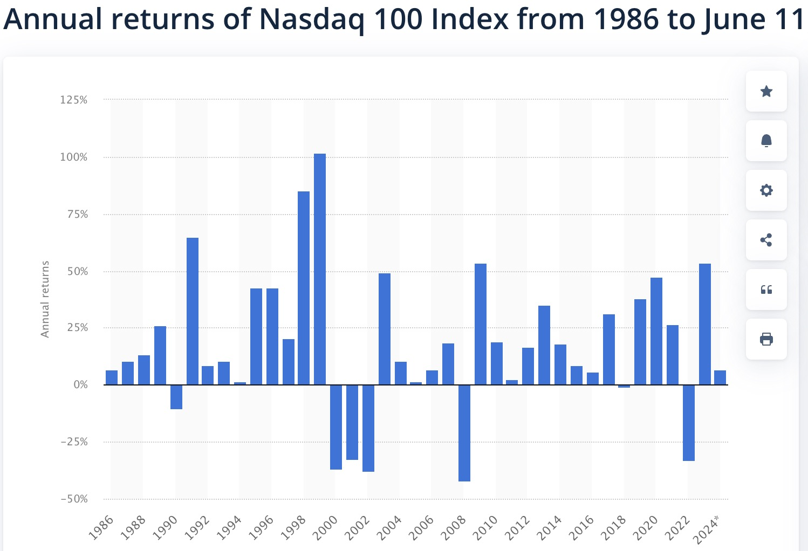

# Very High Order Accurate Time Steppers

## Table of Contents
- [Overview](#Overview)
- [What is a Time Stepper](#What-is-a-Time-Stepper)
- [Penalty Function Method Overview](#Penalty-Function-Method-Overview)
- [Common Applications](#Common-Applications)
- [Formulation](#Formulation)
- [Penalty Function Options](#Penalty-Function-Options)
- [References](#References)

## Overview

Very high order accurate time steppers are numerical methods designed to integrate ordinary differential equations (ODEs) in time with accuracy orders significantly higher than the standard second- to fourth-order methods. While common integrators like the classic fourth-order Runge-Kutta method often suffice for routine problems, there are scenarios where extreme accuracy is desired. for example, in long-term orbit simulations in celestial mechanics, high-precision PDE solvers with spectrally accurate spatial discretizations, or highly sensitive parameter studies.

These methods can take various forms. One common approach is to extend Runge-Kutta (RK) schemes to higher orders by satisfying increasingly complex order conditions (Butcher, 2016; Hairer, Nørsett & Wanner, 1993). For implicit variants, collocation-based RK methods (Gauss-Legendre schemes) naturally yield arbitrarily high order as the number of collocation points increases, though at greater computational cost.

Another class of techniques, known as Spectral Deferred Correction (SDC) methods, start from a low-order approximation and iteratively refine the solution using integral corrections. By systematically performing these correction sweeps, one can achieve very high orders of accuracy (Minion, 2003). General linear methods provide a unifying framework to construct schemes that blend features of RK and linear multistep methods, paving the way for custom-tailored high-order integrators (Butcher, 2016).

Applications of very high order time steppers emerge when the solution is extremely smooth and when spatial discretizations are also high order, ensuring that time discretization does not become the limiting factor in overall solution accuracy. However, maintaining stability, controlling computational costs, and mitigating round-off errors pose nontrivial challenges, which often limit their routine adoption. Instead, these methods are more commonly employed in specialized research scenarios where the utmost accuracy and efficiency gains justify their complexity (Hairer & Wanner, 1996; Ketcheson et al., 2013).

## What is a Time Stepper

A time stepper, also known as a time integration method or time integrator, is a numerical algorithm used to advance the solution of a time-dependent problem from one discrete time level to the next. In other words, given a system of ordinary differential equations (ODEs) or partial differential equations (PDEs) that describe how a physical quantity evolves over time, a time stepper approximates the state of the system at a sequence of discrete time points (e.g., t = 0, Δt, 2Δt, …) starting from initial conditions (Hairer, Nørsett & Wanner, 1993; Butcher, 2016).

At the core, a time stepper is replacing the continuous derivative of the system (i.e., dy/dt = f(t, y)) with something discrete. This approximation is used to “step” forward in time by a user-defined increment of Δt over the chosen interval; a variety of different time steppers can be employed depending on the complexity of the problem and desired accuracy, covering the spectrum from simple, low-order (e.g., Forward Euler) to more sophisticated, higher-order methods (Hairer & Wanner, 1996; Ketcheson et al., 2013). Every time stepper has its own trade-offs in accuracy, stability, computational cost, and implementation complexity.


## References

1. Butcher, J. C. (2016). Numerical Methods for Ordinary Differential Equations. John Wiley & Sons.
2. Hairer, E., Nørsett, S. P., & Wanner, G. (1993). Solving Ordinary Differential Equations I: Nonstiff Problems. Springer.
3. Hairer, E., & Wanner, G. (1996). Solving Ordinary Differential Equations II: Stiff and Differential-Algebraic Problems. Springer.
4. Ketcheson, D. I., Ahmadia, A., & Warburton, T. (2013). High-order strong stability-preserving time discretizations and the CFL condition. J. Sci. Comput., 54(2–3), 149–158.
5. Minion, M. L. (2003). Semi-implicit spectral deferred correction methods for ordinary differential equations. Comm. Math. Sci., 1(3), 471–500.


## Formatting 

Use "GitHub" flavored markdown, a slightly different version of the "vanilla" markdown. The file extension is usually `.md`.
You can include equations in the usual LaTeX-like way, $Ax=b$, or like this
$$Ax=b.$$
You can view the source of this markdown document by clicking the edit/raw button on its source; it's also at [this link](https://raw.githubusercontent.com/numerical-analysis-f23/project-help/main/readme.md).



You can also include images like this (notice that the image file is in the repository)! 


You can also include `.gif`s!

Pseudocode is included via triple backticks, like this
```
Pseudocode
Can
Go 
Here
```
and inline code can `go like this`.

Here are some links for Github-flavored markdown syntax that could be helpful:
* https://github.com/adam-p/markdown-here/wiki/Markdown-Cheatsheet
* https://docs.github.com/en/get-started/writing-on-github/getting-started-with-writing-and-formatting-on-github/basic-writing-and-formatting-syntax
